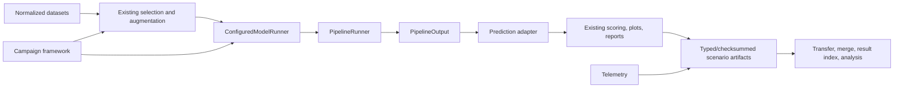

# Current Evaluation Tool Architecture

This document is the compact implementation map for the accepted repository state. Use the [System guide](system_guide.md) for operation and the [Final acceptance audit](final_acceptance_audit.md) for evidence and limitations.

## Boundaries

The speech pipeline is inside the Evaluation Tool repository. There is no second speech-pipeline repository.

The legacy Evaluation Tool continues to own normalized metadata loading, deterministic filters, runtime augmentation, prediction scoring, existing plots/reports, GUI, simulation, and external-stub behavior. The automated framework adds immutable benchmark/scenario contracts, persistent execution, telemetry, distributed exchange, specialized protocols, and cross-scenario analysis.

## Active runtime path

1. `run_evaluation.py` dispatches existing or automated CLI commands.
2. `app/inference_pipeline/catalog.py` builds the runtime catalog from the Stage 0 registry and active component YAML.
3. `app/inference_pipeline/resolver.py` composes a selected higher-level YAML without modifying source fragments.
4. `app/model_runner/configured.py` integrates selected EvaluationRecords and `inference_audio_path` with the pipeline.
5. `app/inference_pipeline/pipeline.py` executes audio loading, VAD, diarization, segmentation, ASR, embedding, matching, label application, and output assembly.
6. The configured prediction adapter preserves source IDs/timestamps, explicit empty text, explicit failures, diagnostics, and `Unknown` semantics.
7. Existing Evaluation Tool scoring/plot/report paths consume standardized predictions.

## Automated framework packages

| Package | Responsibility |
|---|---|
| `app/benchmark_contracts` | Manifest selection, augmentation guards, RIR registry, canonical scenarios/hashes |
| `app/artifact_contracts` | Artifact registry, schemas, atomic publication, checksums, completeness, environment fingerprint |
| `app/campaign_executor` | Planning, SQLite state, lease/heartbeat, subprocess execution, stop/retry/resume |
| `app/resource_telemetry` | Process/system/GPU samples, component spans, resource summaries |
| `app/campaign_exchange` | Worker assignments, independent copies, transfer validation, conflict-safe merge |
| `app/core_screening` | Core component qualification and staged screening |
| `app/extended_backends` / `app/extended_screening` | Optional backend profile/asset qualification and targeted screening |
| `app/speaker_protocol` | Leakage-safe enrollment/calibration/evaluation and speaker metrics |
| `app/diarization_evaluation` | Native manifest, RTTM/UEM validation, diarization scoring/aggregation |
| `app/campaign_analysis` | Result index, registered metrics/statistics/plots, analysis manifest, release reports |

## Public contracts

- Manifest schema: `benchmark-manifest.v1`
- Scenario schema: `scenario-definition.v1`
- Scenario canonicalization/hash: v1, SHA-256, short ID prefix of 12 hex characters
- Artifact registry: versioned v1/v2 registries; completion is scenario-profile dependent
- Campaign state/database: v1
- Analysis manifest/result index/metric and plot registries: v1

Absolute paths, worker/machine, start time, retry number, and output path do not affect scenario identity. Result-affecting configuration, model/assets, condition, seed, repetition, device/dtype/runtime, timeout/resource/scoring/failure policy do.

## Protected behavior

`ExternalStubRunner`, simulation modes, GUI entry points, ordinary CLI selection, normalized metadata, runtime augmentation, existing scoring, plots, and reports remain protected. The final audit's fresh protected regression run passed 331 tests plus GUI validation.

## Current qualification boundary

Core Whisper Tiny/Base/Small, Energy/Silero, VADChunker, ECAPA, cosine matching, and several extended local/ONNX adapters have real qualification evidence. Sherpa diarization and Stage 10 speaker execution have bounded real smokes. Scientific small/standard/large campaign conclusions, blocked credential/platform backends, Stage 5 CUDA-event timing, and dual-GPU concurrency remain outside the accepted evidence boundary.
