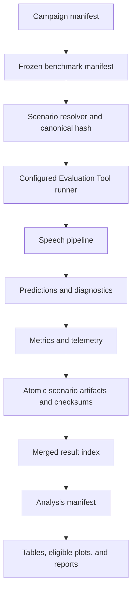
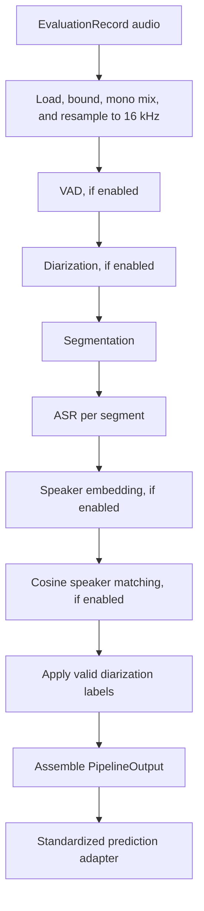

# Automated Speech Evaluation System Guide

## What This System Does

This system turns the existing Evaluation Tool into a reproducible speech-pipeline laboratory. It takes fixed audio selections, runs explicitly identified speech components under controlled or native conditions, records every result and failure, and builds comparisons that another person can reproduce.

```text
audio datasets
  -> fixed benchmark selection
  -> controlled or native conditions
  -> selected speech pipeline
  -> standardized predictions
  -> scoring
  -> timing and resource monitoring
  -> checksummed scenario artifacts
  -> campaign result index
  -> analysis, plots, and reports
  -> evidence-based pipeline selection
```

The selectable component families are voice activity detection (VAD), segmentation, automatic speech recognition (ASR), speaker embeddings, speaker matching, and diarization. Depending on the output and available references, the system measures accuracy, robustness, latency, throughput, CPU, RAM, GPU, VRAM, temperature, power, disk activity, failures, reliability, and reproducibility.

This is a qualified framework, not a completed model-selection study. The final audit verdict is `release_ready_with_documented_limitations`. No small, standard, or large scientific release campaign has yet selected a universal “best” pipeline. Read [Final acceptance audit](final_acceptance_audit.md) before making performance claims.

## Existing Evaluation Tool and automated framework

The two layers have different jobs.

| Layer | Responsibilities |
|---|---|
| Existing Evaluation Tool | Normalized dataset loading, filters, runtime noise/RIR augmentation, inference execution, prediction adaptation, existing scoring, plots, reports, GUI, simulation runner, and external stub runner |
| Automated campaign framework | Frozen benchmark manifests, scenario generation and hashing, persistent scheduling, retries/resume, telemetry, worker assignment, transfer validation, result merging, cross-scenario analysis, release gates, and campaign reports |

The integration boundary is the configured evaluator runner. A scenario supplies an immutable benchmark slice, condition, and resolved inference configuration. The runner sets and uses each row's `inference_audio_path`, calls the existing `PipelineRunner`, adapts `PipelineOutput` to the existing prediction contract, and then invokes existing scoring, plotting, and reporting. It does not replace dataset loading, augmentation, model logic, or existing scoring.

## Architecture

### Overall system



### Actual speech-pipeline order



Diarization precedes final segmentation in the implemented runner. If a diarizer emits turns, VADChunker consumes those turns and the diarizer is the effective segmentation source. Reports must not claim that external VAD controlled final segmentation in that case. Anonymous diarization labels remain anonymous; they are never mapped to reference identities.

For a compact source-level map, see [Current Evaluation Tool architecture](current_evaluation_tool_architecture.md).

## Quick start: one real small-tier scenario

The commands below were checked against the final CLI. They assume Windows PowerShell or Anaconda Prompt and an existing clone. Replace `C:\path\to\just-peachy` with your clone.

### 1. Activate and verify the core CPU environment

Working directory: repository root.

```powershell
cd C:\path\to\just-peachy
.\.venv\Scripts\Activate.ps1
python scripts\verify_install.py --profile dev --device cpu --cache-root models/cache --whisper tiny,base,small --require-models
python -m pip check
```

In Anaconda Prompt or Command Prompt, use `.venv\Scripts\activate.bat` instead
of the PowerShell activation line. The remaining `python` commands are the same.

Purpose: confirm Python, packages, FFmpeg visibility, and the three approved Whisper assets. Success means the verifier reports the required models present and `pip check` reports no broken requirements. Verification must happen before a campaign because scenario execution prohibits implicit downloads.

### 2. Enter the Evaluation Tool and list components

```powershell
cd "Software Validation from Datasets\Evaluation Tool"
python -c "from app.inference_pipeline.catalog import ComponentCatalog; c=ComponentCatalog.load(); print(f'{len(c.entries)} components'); [print(f'{e.family:18} {e.name:36} {e.qualification_status}') for e in c.entries]"
```

Success currently starts with `27 components` and prints each runtime component's status. This is a verified catalog inspection command; there is no dedicated `list-components` CLI subcommand.

### 3. Preview the selected benchmark work without writing it

```powershell
python run_evaluation.py campaign plan --dry-run --tier small --panel controlled_clean --component asr=whisper_base
```

Success is JSON with `dry_run: true`, campaign ID `campaign_3d265ecaaef6`, and 12 matching scenarios in the current v1 catalog. A dry run creates no campaign directory.

### 4. Create and validate a one-scenario campaign

The globally stable scenario `scenario_8cff9abad3fc` is the current small-tier CMU Arctic clean, full-record, Whisper Base CPU scenario. It contains 90 benchmark rows.

```powershell
python run_evaluation.py campaign plan --campaign-id campaign_quickstart --scenario-id scenario_8cff9abad3fc
python run_evaluation.py campaign validate --campaign-root automated_runs\campaign_quickstart
python run_evaluation.py campaign list --campaign-root automated_runs\campaign_quickstart
```

Success means the plan reports one scenario, validation returns no error, and the list reports it as `pending`. If a campaign with that ID already exists, use a different short ID; never overwrite an old completed campaign.

### 5. Execute and inspect status

```powershell
python run_evaluation.py campaign run --campaign-root automated_runs\campaign_quickstart --worker-id local_cpu --max-scenarios 1
python run_evaluation.py campaign status --campaign-root automated_runs\campaign_quickstart
python run_evaluation.py campaign validate-artifacts --campaign-root automated_runs\campaign_quickstart
```

The terminal prints state/progress information. Success is `succeeded` or `succeeded_with_warnings` plus a complete artifact-validation result. A failed item remains in diagnostics/failures; it is not silently dropped.

### 6. Build analysis without rerunning inference

```powershell
python run_evaluation.py analysis index --campaign-root automated_runs\campaign_quickstart
python run_evaluation.py analysis validate --campaign-root automated_runs\campaign_quickstart
python run_evaluation.py analysis run --campaign-root automated_runs\campaign_quickstart
python run_evaluation.py analysis coverage --campaign-root automated_runs\campaign_quickstart
python run_evaluation.py analysis release-status --campaign-root automated_runs\campaign_quickstart
```

The primary report is `automated_runs\campaign_quickstart\analysis\report\campaign_report.md`. With only one scenario, comparison plots and statistical tests will be skipped explicitly. That is correct behavior, not an analysis failure.

## Installation and environment profiles

Isolated environments keep native runtimes and incompatible package constraints from contaminating the qualified core environment. A campaign records the expected profile and an environment fingerprint; results from different profiles can be reported but should not be treated as interchangeable performance measurements.

### Core CPU installation

From the repository root:

```powershell
powershell -ExecutionPolicy Bypass -File install.ps1 -Profile dev -Device cpu -WhisperModels tiny,base,small -DownloadModels
.\.venv\Scripts\python.exe scripts\verify_install.py --profile dev --device cpu --cache-root models/cache --whisper tiny,base,small --require-models
```

`-DownloadModels` is an explicit setup action. It is never performed by the runner. Use `-ForceRecreateVenv` only when intentionally replacing the core environment; the installer preserves the old environment as a backup.

### Profile matrix

| Profile | Purpose and components | OS / hardware | Install and activate | Qualification or incompatibility |
|---|---|---|---|---|
| `core-cpu` | Whisper Tiny/Base/Small, Energy/Silero, VADChunker, ECAPA, cosine | Windows/Linux/macOS; CPU | Core command above; PowerShell `.\.venv\Scripts\Activate.ps1`; Anaconda/cmd `.venv\Scripts\activate.bat` | Qualified reference; ordinary framework tests run here |
| `core-cuda` | Core Whisper/ECAPA on one NVIDIA GPU | Windows/Linux; NVIDIA CUDA 12.8 runtime | From repo root: `powershell -ExecutionPolicy Bypass -File scripts\install_stage8_profile.ps1 -Profile core-cuda`; activate with `Activate.ps1` or `activate.bat` under `.stage8-envs\core-cuda\Scripts` | 4/4 real model qualification on RTX 3080; Stage 5 CUDA-event telemetry smoke remains outstanding |
| `extended-local` | Faster-Whisper, Vosk, WebRTC VAD, Resemblyzer | Cross-platform CPU; optional unqualified CUDA | `powershell -ExecutionPolicy Bypass -File scripts\install_stage8_profile.ps1 -Profile extended-local -DownloadModels` | Four real qualifications; WebRTC has a warning |
| `onnx` | Sherpa ASR, VAD, embedding, diarization | Cross-platform CPU | `powershell -ExecutionPolicy Bypass -File scripts\install_stage8_profile.ps1 -Profile onnx -DownloadModels` | Four real qualifications |
| `wenet` | WeNet ASR | Windows/Linux CPU candidate | `powershell -ExecutionPolicy Bypass -File scripts\install_stage8_profile.ps1 -Profile wenet -DownloadModels` | Package installed; required `final.zip` absent, so unavailable |
| `wespeaker` | WeSpeaker embedding | Cross-platform CPU | `powershell -ExecutionPolicy Bypass -File scripts\install_stage8_profile.ps1 -Profile wespeaker -DownloadModels` | Real qualified with recorded dependency mismatch warning |
| `credential-diarization` | pyannote Community-1 and Picovoice Falcon | Cross-platform CPU/GPU | `powershell -ExecutionPolicy Bypass -File scripts\install_stage8_profile.ps1 -Profile credential-diarization -DownloadModels` after personal terms/credential setup | Not configured on this machine; both remain credential/license gated |
| `nemo-linux-cuda` | NeMo composite diarization | Linux plus NVIDIA CUDA only | `bash scripts/install_stage8_nemo_linux.sh`, then activate `.stage8-envs/nemo-linux-cuda/bin/activate` | Platform and active checkpoints unresolved; unavailable |

After installing an extended profile, qualify it from the repository root:

```powershell
.\.stage8-envs\extended-local\Scripts\python.exe "Software Validation from Datasets\Evaluation Tool\scripts\qualify_extended_backends.py" --profile extended-local
```

Substitute the matching environment and profile (`onnx`, `wenet`, or `wespeaker`). Never infer qualification merely from successful installation.

## Models, assets, credentials, and licensing

- A **package** is installed Python/runtime code.
- An **implementation** is the adapter class used by this project.
- A **model checkpoint** is the learned weight asset.
- A **configuration** selects the implementation and runtime settings.
- An **environment** is the isolated package/runtime set.
- A **credential** grants private or licensed access; it is not a model asset and must never enter shared artifacts.

Core assets are under `models/cache`. The exact expected/observed hashes are recorded in `configs/automated_evaluation/component_registry.v1.yaml`, `configs/automated_evaluation/model_asset_registry.v1.yaml`, and each resolved scenario. Core frozen identities include:

| Asset | Location | Frozen identity/status |
|---|---|---|
| Whisper Tiny | `models/cache/whisper/tiny.pt` | 75,572,083 bytes; SHA-256 `65147644...CE22B9`; present |
| Whisper Base | `models/cache/whisper/base.pt` | 145,262,807 bytes; SHA-256 `ED3A0B6B...26E34E`; present |
| Whisper Small | `models/cache/whisper/small.pt` | 483,617,219 bytes; SHA-256 `9ECF7799...1E794`; present |
| SpeechBrain ECAPA | `models/cache/speechbrain/spkrec-ecapa-voxceleb` | Five required files, each individually hashed; present |
| Faster-Whisper Tiny | `models/cache/faster_whisper/tiny` | Immutable source revision; qualified in `extended-local` |
| Vosk small English | `models/cache/vosk/asr/vosk-model-small-en-us-0.15` | Archive SHA-256 frozen; qualified |
| Sherpa models | `models/cache/sherpa_onnx/...` | ASR, VAD, embedding, and diarization assets individually registered and qualified |
| Resemblyzer | Environment package `pretrained.pt` | Packaged with pinned runtime; qualified |
| WeSpeaker | `models/cache/wespeaker/english` | Archive SHA-256 frozen; qualified with warning |
| WeNet | `models/cache/wenet/asr/librispeech_u2pp_conformer_exp` | Archive retained, but runtime-required `final.zip` missing |
| pyannote Community-1 | `models/cache/pyannote` | Gated; user must accept terms and supply `PYANNOTE_AUTH_TOKEN` |
| Falcon | Backend-managed licensed access | User must supply `PICOVOICE_ACCESS_KEY`; no key value may be logged |
| NeMo | `models/cache/nemo/diarization` | Config/checkpoint choice unresolved; Linux/CUDA qualification required |

Before redistributing any checkpoint, review the model-card and dataset-derived terms recorded in the asset registry. Hashes prove identity, not redistribution permission.

For credential-gated setup, set secrets only in the current process or an approved secret manager. The framework records only presence/absence. Do not place values in YAML, JSON, command arguments, shell history, logs, assignments, or transfer folders.

## Components you can choose

Qualification means the adapter produced repeated contract-valid output in its specified environment. It does not mean that it won a scientific comparison.

Disabled/no-op components exist for every family so the resolver can record an
explicit disabled state. `no_op_vad` and `no_op_segmentation` implement the
full-record baseline. `no_op_asr`, `no_op_speaker_embedding`,
`no_op_speaker_matching`, and `no_op_diarization` are contract-qualified test or
disabled-slot implementations, not scientific model candidates.

### VAD

VAD marks regions likely to contain speech. It can reduce wasted ASR work, but missed speech can never be recovered downstream.

| Component | Environment/status | Major settings and use | Limitations |
|---|---|---|---|
| Full record / `no_op_vad` | Core; contract-qualified | Baseline with no speech filtering | Includes silence/noise; useful for isolating VAD effects |
| `energy_vad` | Core; qualified | Energy threshold and duration behavior; transparent CPU baseline | Sensitive to noise and recording level |
| `silero_vad` | Core; qualified | Neural VAD; balanced reference candidate | Requires local packaged model/runtime |
| `webrtc_vad` | `extended-local`; qualified with warning | Lightweight frame-based speech decision; CPU/edge candidate | Strict frame/sample assumptions and recorded warning |
| `sherpa_onnx_vad` | `onnx`; qualified | Local ONNX Silero VAD; useful in Sherpa stack | Separate ONNX environment and asset |

### Segmentation

Segmentation turns speech regions into ASR-sized chunks. Full record is simplest. `vad_chunks` can merge nearby regions (`merge_gap`), add edge context (`padding`), and cap long chunks (`max_chunk`). Smaller chunks can lower latency but lose context; excessive merging can mix speakers. When diarizer turns exist, those turns become the input to chunking.

### ASR

| Component | Environment/status | Strength or suitable use | Limitation |
|---|---|---|---|
| Whisper Tiny | Core CPU/CUDA; qualified | Smallest core Whisper; useful speed/resource anchor | Expected accuracy tradeoff must be measured |
| Whisper Base | Core CPU/CUDA; qualified | Required reference ASR for VAD screening | Not a declared winner |
| Whisper Small | Core CPU/CUDA; qualified | Larger core accuracy/resource candidate | Higher measured VRAM and initialization cost |
| Faster-Whisper | `extended-local`; qualified | CTranslate2 implementation and deployment-oriented speed candidate | Compare output and timing on identical items |
| Sherpa-ONNX ASR | `onnx`; qualified | Local ONNX streaming-oriented stack | Separate assets/environment |
| Vosk | `extended-local`; qualified | Lightweight offline CPU candidate | Different recognition tradeoff; no winner claim |
| WeNet | `wenet`; unavailable asset | Extensible ASR candidate | Required `final.zip` is missing |

Whisper Large is intentionally out of scope.

### Speaker embeddings

An embedding is a numeric voice signature: utterances from the same speaker should be closer than utterances from different speakers, but degradation and short audio can move the vector.

| Component | Environment/status | Use | Limitation |
|---|---|---|---|
| SpeechBrain ECAPA | Core; qualified | Reference extraction and current Stage 10 protocol | Full degraded scientific protocol not run |
| Resemblyzer | `extended-local`; qualified | Lightweight d-vector comparison | Must use backend-specific enrollment |
| Sherpa embedding | `onnx`; qualified | ONNX speaker stack | Must not reuse ECAPA enrollment |
| WeSpeaker | `wespeaker`; qualified with warning | Additional embedding tradeoff | Isolated dependency mismatch is recorded |

### Speaker matching

The cosine matcher compares a probe embedding with backend-compatible enrolled embeddings. Higher cosine similarity generally means more alike. A threshold decides “known” versus `Unknown`; a margin can require the best candidate to be sufficiently better than the runner-up. Thresholds must be calibrated on held-out calibration probes, not evaluation probes. Preserve literal `Unknown` as a scored output. The fixed thresholds in legacy example YAML are demonstrations, not deployment calibration.

### Diarization and related concepts

- VAD asks “is anyone speaking?”
- Segmentation asks “what chunk should the next component process?”
- Speaker embeddings represent voice characteristics.
- Matching asks whether an embedding belongs to an enrolled identity.
- Speaker-change detection locates a likely change without necessarily assigning consistent speakers.
- Diarization asks “who spoke when?” using anonymous labels unless valid enrollment matching is applied.

| Component | Environment/status | Current use | Limitation |
|---|---|---|---|
| Sherpa-ONNX diarization | `onnx`; bounded qualified smoke | Anonymous-turn and RTTM contract on AMI | One-item smoke is not scientific ranking |
| pyannote Community-1 | `credential-diarization`; blocked | Potential authorized diarization backend | Terms/token and local qualification required |
| Picovoice Falcon | `credential-diarization`; blocked | Potential licensed diarization backend | Access key/licensing and local qualification required |
| NeMo | `nemo-linux-cuda`; blocked | Meeting diarization candidate | Linux/CUDA, config, and active checkpoints required |

## Pipeline configuration and provenance

Higher-level YAML files in `configs/inference` compose component fragments from `configs/inference/components`. For example, `configs/inference/live_mic_whisper_base.yaml` selects the Whisper Base fragment and disables other families. `configs/inference/simple_vad_speaker_change_enrollment.yaml` composes Silero, VADChunker, Whisper Base, ECAPA, and cosine matching.

For a one-record ordinary Evaluation Tool smoke:

```powershell
python run_evaluation.py full --dataset cmu_arctic --max-recordings 1 --runner configured --inference-config configs\inference\live_mic_whisper_base.yaml --run-name base_one_item
```

The resolver:

1. loads the selected higher-level YAML;
2. selects one implementation per family;
3. merges component fragments without modifying them;
4. checks compatibility, assets, credentials, platform, device, and dtype;
5. records every override's source and final value;
6. writes the resolved config and component identities.

An explicit override uses dotted YAML values, for example:

```powershell
python run_evaluation.py run --dataset cmu_arctic --max-recordings 1 --runner configured --inference-config configs\inference\live_mic_whisper_base.yaml --inference-override runtime.num_threads=2
```

Any result-affecting override in a campaign requires a newly resolved scenario and therefore a new scenario ID. Never edit `resolved_scenario.json` or a result after execution.

To determine exactly what ran, inspect `resolved_scenario.json`, `run_config.yaml`, `status.json`, the environment fingerprint, and `checksums.json`. These contain selected/resolved YAML hashes, implementation classes, model identities/assets/hashes, runtime, seed, condition, scoring policy, worker/machine evidence, and artifact checksums.

## Benchmark datasets and panels

| Panel | Data role | Datasets | Synthetic augmentation |
|---|---|---|---|
| `controlled_clean` | Clean baseline and controlled degradation | CMU Arctic, LibriSpeech clean, HiFiTTS clean | Approved white/pink noise and exact approved RIRs allowed |
| `native_robustness` | Naturally noisy, reverberant, far-field, meeting, and conversational conditions | AMI, VOiCES, CHiME-6; approved LibriSpeech/HiFiTTS `other` | Forbidden |
| `speaker_protocol` | Disjoint enrollment, calibration, known/unknown clean/degraded probes | Authorized rows selected by Stage 10 contract | Only approved degraded probes; enrollment remains clean |

CMU Arctic supplies clean single-speaker utterances. LibriSpeech and HiFiTTS supply clean and explicitly separated `other` subsets. AMI supplies meetings and headset/array streams. VOiCES supplies native room, distractor, microphone, distance, and position factors. CHiME-6 supplies conversational sessions, close/far-field streams, devices, channels, and location hints.

The authoritative manifests are versioned Parquet, selected independently of dataframe order with canonical hash ranks using seed `3800`, dataset key, source recording ID, and utterance ID. Tiers are:

| Tier | Current realized source rows | Intended use |
|---|---:|---|
| Small | 405 | First real release gate and bounded screening |
| Standard | 2,083 | Confirmation after small passes |
| Large | 8,258 | Release-level validation only |

Requested counts may exceed available eligible metadata; every shortfall and reason is saved. No source audio is copied into the manifest.

## Acoustic conditions

- **Clean:** no synthetic noise or reverberation.
- **White noise:** equal power per frequency bin; a controlled stressor.
- **Pink noise:** more low-frequency energy; another controlled stressor.
- **SNR:** signal-to-noise ratio in decibels. Higher values are cleaner; 20 dB is milder than 10 dB.
- **RIR:** room impulse response convolved with clean audio to simulate a specific measured environment.
- **RIR plus noise:** exact RIR simulation followed by the declared noise condition.

The smoke set contains clean, white 10 dB, pink 10 dB, and Dining room. The core controlled set contains white/pink at 20 and 10 dB, Dining room, Restaurant, and selected RIR-plus-pink-10 dB interactions.

The RIR registry freezes exact relative path and SHA-256. Current requested scope is Dining room, Bedroom, and Restaurant. Dining and Restaurant are approved. Bedroom is unresolved and therefore absent from executable scenarios. `h044_ParkingLot_4txts.wav` is ParkingLot, not Kitchen and not Bedroom; it is excluded from this scope. Native robustness rows never receive synthetic noise or RIR, preventing double augmentation.

## Campaign concepts

- A **campaign** is one global set of planned scenarios and policies.
- A **benchmark manifest** freezes the selected audio rows.
- A **scenario** is one immutable benchmark slice, condition, pipeline, runtime, scoring policy, seed, and repetition.
- A **scenario ID** is `scenario_` plus the first 12 hexadecimal characters of the canonical SHA-256.
- A **worker assignment** names a non-overlapping subset of global scenario IDs.
- An **attempt** is one execution try for the same scenario identity.
- A **result** is the validated artifact set for a scenario.

Example: CMU Arctic + white noise at 10 dB + Silero + VADChunker + Whisper Base + speaker disabled + CUDA + repetition 1 becomes reproducible because all those result-affecting values and source hashes are inside canonical scenario identity. Worker, machine, absolute output path, start time, and retry number are excluded. Retrying unchanged work keeps the same ID; changing a component, model, condition, seed, device/dtype, or scoring policy requires a new ID.

## Creating a campaign

The current general campaign CLI filters an already approved scenario catalog. Tier, panel, component, ID, and ID range are CLI filters:

```powershell
python run_evaluation.py campaign plan --dry-run --tier small --panel controlled_clean --component asr=whisper_base
python run_evaluation.py campaign plan --campaign-id campaign_core01 --tier small --panel controlled_clean --component asr=whisper_base --default-max-retries 1
python run_evaluation.py campaign validate --campaign-root automated_runs\campaign_core01
```

Conditions, repetitions, device, dtype, timeout, and resource policy are result-affecting fields already frozen inside `benchmarks\v1\resolved_scenarios.jsonl` or another explicitly passed `--catalog`. There are no general `campaign plan --condition`, `--repetitions`, or `--device` flags. Select scenario IDs from an approved catalog, or generate and review a new versioned catalog in the benchmark/screening workflow before planning. Do not hand-edit a catalog after IDs are issued.

Inspect a scenario before planning:

```powershell
python -c "import json; sid='scenario_8cff9abad3fc'; row=next(json.loads(x) for x in open('benchmarks/v1/resolved_scenarios.jsonl',encoding='utf-8') if json.loads(x)['scenario_id']==sid); print(json.dumps({'id':sid,'panel':row['panel'],'tier':row['tier'],'dataset':row['dataset_slice'],'condition':row['condition'],'runtime':row['runtime'],'repetition':row['repetition']},indent=2))"
```

Dry-run output gives exact scenario count and selected manifest identity. Manifest summaries give audio duration. The current planner does not promise compute time or storage estimates; use a bounded smoke to measure RTF and artifact size before extrapolating.

Scientific screening avoids a full Cartesian product:

1. qualify availability/contracts;
2. compare Whisper models on fixed full records;
3. vary VAD/segmentation with Whisper Base fixed;
4. cross-check the strongest one or two segmenters across qualified ASR;
5. qualify embeddings on fixed segments;
6. run only targeted plausible interactions and repeat finalists.

## Running, stopping, and resuming

### Normal lifecycle

```powershell
python run_evaluation.py campaign plan --campaign-id campaign_core01 --tier small --panel controlled_clean --component asr=whisper_base --default-max-retries 1
python run_evaluation.py campaign validate --campaign-root automated_runs\campaign_core01
python run_evaluation.py campaign run --campaign-root automated_runs\campaign_core01 --worker-id amir --telemetry --telemetry-interval-sec 1.0
python run_evaluation.py campaign status --campaign-root automated_runs\campaign_core01
python run_evaluation.py campaign stop --campaign-root automated_runs\campaign_core01 --reason "planned shutdown"
python run_evaluation.py campaign resume --campaign-root automated_runs\campaign_core01 --worker-id amir
python run_evaluation.py campaign retry --campaign-root automated_runs\campaign_core01
python run_evaluation.py campaign validate-artifacts --campaign-root automated_runs\campaign_core01
```

`run` leases one scenario, records heartbeat, launches the configured evaluator in an isolated process, publishes partial/final artifacts atomically, and continues after an isolated failure. Telemetry defaults to enabled at one-second sampling. Disk free space defaults to a 5 GB minimum. One GPU-heavy scenario at a time is the qualified default.

### Practical mid-campaign shutdown

1. Request a stop with the command above. A scenario-specific stop adds `--scenario-id scenario_...`.
2. Watch `campaign status` until active work becomes `stopped` or `interrupted`. If necessary, press Ctrl+C once; the executor requests controlled child termination and preserves artifacts.
3. Shut down only after the process exits.
4. After reboot, activate the same environment and verify the same Git commit/assets.
5. Run `campaign validate`, then `campaign resume` with the same worker ID.
6. Validate artifacts after completion.

Do not kill Python repeatedly, delete the SQLite database, rename scenario folders, edit `status.json`, remove leases manually, or copy a campaign while an artifact is being written. Resume reclaims stale leases, validates successful artifacts before skipping them, and requeues only eligible states within retry policy.

## Two-machine operation

Both users clone the complete repository and use the same commit, campaign manifest, benchmark manifests, scenario IDs, model/config identities, seed, and declared environment profile. Hardware fingerprints may differ and remain visible in analysis.

### Coordinator: create non-overlapping assignments

```powershell
python run_evaluation.py campaign assign --campaign-root automated_runs\campaign_core01 --worker-id amir --environment-profile core-cpu --partition-index 0 --partition-count 2
python run_evaluation.py campaign assign --campaign-root automated_runs\campaign_core01 --worker-id friend --environment-profile core-cpu --partition-index 1 --partition-count 2
python run_evaluation.py campaign validate-assignments --campaign-root automated_runs\campaign_core01 --assignment automated_runs\campaign_core01\worker_assignments\worker_amir.yaml --assignment automated_runs\campaign_core01\worker_assignments\worker_friend.yaml
```

Instead of deterministic partitions, `assign` supports repeatable `--scenario-id`, `--scenario-range START:END`, `--component family=name`, `--dataset`, `--panel`, and `--maximum-scenario-count`. Manual division is valid only after both assignment files pass overlap validation.

### Prepare each independent campaign copy

```powershell
python run_evaluation.py campaign prepare-worker-copy --campaign-root automated_runs\campaign_core01 --assignment automated_runs\campaign_core01\worker_assignments\worker_amir.yaml --destination C:\worker_campaigns\amir_core01
```

Transfer that prepared folder to the matching full clone. Machine B repeats with its own assignment. Do not point both machines at one network SQLite database: network-file locking and partial connectivity make leases and atomicity fragile.

### Machine A and Machine B

From each local Evaluation Tool directory, using its local copied campaign root:

```powershell
python run_evaluation.py campaign run-assignment --campaign-root C:\worker_campaigns\amir_core01 --assignment C:\worker_campaigns\amir_core01\worker_assignments\worker_amir.yaml --environment-profile core-cpu
python run_evaluation.py campaign export-results --campaign-root C:\worker_campaigns\amir_core01 --assignment C:\worker_campaigns\amir_core01\worker_assignments\worker_amir.yaml --environment-profile core-cpu --destination C:\transfer\transfer_amir
```

The friend substitutes their paths and `worker_friend.yaml`.

### Coordinator: validate and merge

```powershell
python run_evaluation.py campaign validate-transfer --campaign-root automated_runs\campaign_core01 --transfer-root C:\transfer\transfer_amir
python run_evaluation.py campaign validate-transfer --campaign-root automated_runs\campaign_core01 --transfer-root C:\transfer\transfer_friend
python run_evaluation.py campaign merge-results --campaign-root automated_runs\campaign_core01 --transfer-root C:\transfer\transfer_amir --transfer-root C:\transfer\transfer_friend
python run_evaluation.py campaign validate-merged --campaign-root automated_runs\campaign_core01
```

The merge recognizes byte-identical duplicates, rejects conflicting duplicates, reports missing work and environment differences, verifies every checksum, and never changes global scenario IDs or silently overwrites a result.

## Output directory walkthrough

```text
automated_runs/<campaign_id>/
  campaign_manifest.json
  campaign_manifest.sha256
  benchmark_manifests/
  worker_assignments/
  database/campaign.sqlite
  scenarios/<scenario_id>/
    resolved_scenario.json
    run_config.yaml
    status.json
    predictions/utterances.jsonl
    predictions/diagnostics.jsonl
    metrics/item_metrics.parquet
    metrics/grouped_metrics.parquet
    metrics/summary.json
    metrics/failures.parquet
    resource_logs/resource_usage.parquet
    resource_logs/component_spans.jsonl
    resource_logs/resource_summary.json
    logs/events.jsonl
    logs/runner.log
    logs/errors.jsonl
    report/scenario_report.json
    report/scenario_report.md
    checksums.json
  analysis/
    analysis_manifest.json
    campaign_result_index.json
    coverage_matrix.json
    metric_availability.json
    plot_status.json
    tables/
    plots/
    report/campaign_report.md
```

Conditional artifacts such as `predictions/words.jsonl`, `segments.rttm`, embeddings, an embedding index, similarity scores, threshold sweeps, or diarization diagnostics appear only when real component output supports them.

| Artifact group | Producer and content | Who normally uses it |
|---|---|---|
| Campaign/benchmark manifests | Planner; global identities, planned scenarios, immutable audio rows | Everyday user and provenance |
| Worker assignments | Assignment tool; exact non-overlapping global IDs and expected environment | Distributed operators |
| SQLite state/status/events | Executor; state, lease, heartbeat, attempts, stop and failures | `status` first; files for debugging |
| Resolved scenario/run config | Resolver; full result-affecting identity, selected/resolved config and hashes | Reproducibility and debugging |
| Predictions/diagnostics/failures | Configured runner; standardized output, original unknown token, component diagnostics, explicit errors | Everyday inspection and scoring |
| Item/grouped/summary metrics | Existing and stage-specific scorers | Analysis |
| Resource samples/spans/summary | Telemetry sampler and span recorder | Performance analysis/debugging |
| RTTM/UEM/embeddings/scores | Speaker or diarization workflows | Specialized analysis; conditional |
| Scenario reports | Existing reporter/framework adapters | Everyday scenario review |
| Checksums | Atomic artifact store | Validation, transfer, provenance; do not edit |
| Analysis manifest/result index | Analysis indexer | Analyst handoff and reruns |
| Tables/plots/campaign report | Analysis runner | Everyday comparison and final interpretation |

## Worked end-to-end evidence trace

No real scientific campaign exists yet, so this guide does not fabricate one. The accepted end-to-end trace is the validated Stage 12 synthetic two-worker campaign; it proves orchestration and analysis mechanics only. A separate real Stage 1 Whisper Base one-item trace proves the configured evaluator boundary.

### Validated synthetic campaign trace

1. **Benchmark record:** a typed synthetic manifest row with a globally planned scenario ID; it contains no research audio or reference transcript.
2. **Scenario:** four global synthetic scenarios were deterministically split between `worker_amir` and `worker_friend`.
3. **Resolved config:** each scenario stored `resolved_scenario.json` and `run_config.yaml` with schema/hash identity.
4. **Components:** the `synthetic_executor` profile deliberately used deterministic fixture behavior, not Whisper or another model.
5. **Prediction/reference:** not applicable to this scenario type; the artifact profile correctly omitted `utterances.jsonl` instead of inventing ASR output.
6. **Item metrics:** not applicable; `synthetic_success` and explicit failure/completion evidence were stored in scenario summaries.
7. **Resources:** scenario artifacts used the profile's required outputs; separate Stage 5 executor evidence validates telemetry publication.
8. **Scenario summary:** scenario reports and checksum manifests validated.
9. **Merge:** two independently copied worker result packages merged to four unchanged global IDs.
10. **Analysis:** the result index reconciled all four scenarios; 19 metric availability records and 20 plot statuses were produced.
11. **Plots:** coverage and reliability plots were eligible; 18 other plots were explicitly skipped because model metrics/references were absent.

Interpretation: configuration led to a deterministic implementation, atomic artifacts, registered metrics, eligibility-gated plots, and a reproducible report. The result says “campaign mechanics work”; it says nothing about ASR accuracy.

### Real configured-evaluator trace

Stage 1 ran one real CMU Arctic item through local Whisper Base using the ordinary Evaluation Tool. The source record's `recording_id`, `source_recording_id`, `utt_id`, `start_sec`, and `end_sec` survived adaptation; the model transcript—not reference text—entered `predictions/utterances.jsonl`; scoring, 11 existing plots, and reports completed. Prediction speaker remained null when speaker processing was disabled, proving there was no reference-speaker fallback.

Together, these traces establish the integration boundary and full campaign mechanics. The first real small release campaign is still required before comparing pipeline quality.

## Understanding metrics

The campaign-level registry contains exactly these 19 headline metrics:

| Registry metric | Plain meaning | Better direction |
|---|---|---|
| `scenario_completion` | Validated completed scenarios divided by planned scenarios | Higher |
| `failure_rate` | Failed items or scenarios divided by the declared selected/planned population | Lower |
| `micro_wer` | Aggregate word error rate | Lower |
| `micro_cer` | Aggregate character error rate | Lower |
| `vad_speech_recall` | Fraction of compatible reference speech retained | Higher |
| `vad_false_alarm_duration_sec` | Predicted speech seconds outside reference speech | Lower |
| `latency_p95_sec` | 95th-percentile valid latency | Lower |
| `real_time_factor` | Inference wall seconds per audio second | Lower |
| `throughput_audio_sec_per_wall_sec` | Audio seconds processed per wall second | Higher |
| `peak_cpu_percent` | Maximum sampled process-tree CPU | Constraint; lower for equal work |
| `peak_rss_bytes` | Maximum sampled resident memory | Constraint; lower for equal work |
| `peak_vram_bytes` | Maximum sampled GPU memory | Constraint; lower for equal work |
| `embedding_eer` | Held-out equal-error rate | Lower |
| `speaker_top1_accuracy` | Correct top-1 known-speaker decisions | Higher |
| `unknown_rejection_rate` | Correctly rejected held-out unknown probes | Higher |
| `embedding_drift` | Paired clean-to-degraded cosine distance | Lower |
| `diarization_der` | Diarization error rate under a valid policy | Lower |
| `diarization_jer` | Speaker Jaccard error rate | Lower |
| `synthetic_success` | Contract-only synthetic fixture success | Higher; never a model-quality metric |

Detailed Stage 7, 10, and 11 artifacts contain additional diagnostics and
metrics described below; not all are campaign-level headline entries.

### ASR

| Metric | Meaning/formula and denominator | Better | Cautions |
|---|---|---|---|
| Micro WER | `(S + I + D) / total reference words` over all items | Lower | Long utterances weigh more; may exceed 100% when insertions are numerous |
| Macro WER | Mean of per-item WER over valid declared items | Lower | Each item weighs equally; always report item count and failure policy |
| Micro/macro CER | Character errors divided by reference characters, aggregated globally/per item | Lower | Normalization and script/language must match |
| Substitutions/insertions/deletions | Alignment error counts | Lower | Diagnose error type; totals reconcile WER numerator |
| Empty transcript | Successful prediction with explicit `text: ""` | Lower rate | Different from a failed or missing prediction |
| Missing/malformed/duplicate/unexpected | Contract/reconciliation counts | Zero | Must remain visible and affect reliability denominators |
| Repetition/hallucination | Registered repeated-token/phrase diagnostics | Lower | Diagnostic, not a universal hallucination truth label |
| Clean-to-degraded change | Paired degraded minus clean metric on identical items | Smaller increase | Requires exact pairing and compatible scoring |

### VAD and segmentation

Precision is correctly predicted speech divided by predicted speech; recall is detected reference speech divided by reference speech; F1 is their harmonic mean. Missed speech and false alarm are durations. Region IoU measures temporal overlap. Boundary deviation measures start/end error. Fragmentation splits one reference region into too many predictions; merge rate combines distinct regions. Segment count, duration distribution, empty/too-short segments, and downstream WER show operational effects.

These metrics require compatible timed references. A collar/tolerance ignores small boundary differences according to the recorded scoring policy. Never compare values with different collars, overlap policies, or scored regions.

### Runtime

- Initialization/cold start includes model loading and first-use setup.
- Warm inference excludes one-time initialization where the span contract permits.
- Component time is recorded by named spans; wall time includes orchestration around them.
- `RTF = inference wall seconds / audio seconds`: below 1 is faster than real time, 1 equals real time, and above 1 is slower.
- Throughput is audio seconds per wall second; multiply by 3,600 for audio-hours per wall-hour.
- Mean is sensitive to outliers; median is the middle; p90/p95/p99 describe increasingly extreme tail latency.

### Resources

Process CPU/RSS/VMS describe the scenario process tree; system CPU/RAM include the whole machine. RSS is resident physical memory; VMS is mapped virtual address space and is not equivalent to RAM consumption. GPU utilization, memory utilization, current/peak VRAM, temperature, power/limit, optional clocks/throttling, process/system disk bytes, and free disk are sampled when sensors support them. Unsupported values are null with a reason—never zero-filled. Sampling is approximate; one-second peaks can miss very short spikes.

### Speaker

| Metric | Meaning | Better/validity |
|---|---|---|
| Extraction success/norm | Valid embeddings divided by requested probes; norm checks finite normalized vectors | Higher success; expected norm per backend |
| Same/different similarity | Score distributions for true same/different trials | More separation |
| Drift | `1 - cosine(clean, degraded)` for paired probes | Lower |
| EER | Operating point where FAR and FRR are closest | Lower; held-out calibration/evaluation separation required |
| FAR/FRR | False accepts per different/unknown trials; false rejects per same/known trials | Lower at declared threshold |
| TAR at FAR | True accept rate at a fixed false-accept constraint | Higher at the same FAR |
| Top-1/top-k | Correct identity in first/best k choices per valid known probe | Higher; closed-set only |
| Unknown rejection | Correct `Unknown` decisions per valid unknown probe | Higher; open-set only |
| False-known | Unknown probes incorrectly assigned an enrolled identity | Lower |
| Enrollment/probe failure | Failed enrollments/probes over requested counts | Lower; failures stay in denominators |

Enrollment, calibration, and evaluation utterances must be disjoint. Thresholds come from calibration data and are then frozen for held-out evaluation. Closed-set identification assumes every probe is known; open-set evaluation includes `Unknown` and must be reported separately.

### Diarization

`DER = (missed speech + false alarm + speaker confusion) / reference speaker time`. JER is a permutation-aware mean speaker Jaccard error. Speaker-count error is estimated minus reference count. cpWER/speaker-attributed WER is emitted only where the implementation and references support a correctly defined permutation-aware transcript comparison.

A collar tolerates boundary uncertainty. UEM defines the scored time region. Overlap-aware and overlap-excluded policies are different results. Oracle speaker count is supplied from reference knowledge and must be labeled diagnostic; estimated count comes from the system. Invalid RTTM/UEM timebases suppress DER/JER rather than producing misleading numbers.

### Reliability

Valid-output rate, scenario completion, item/scenario failure, retry, timeout, OOM, interruption, missing scenarios, checksum failure, and transfer failure describe whether the system can be trusted unattended. A missing or failed output cannot disappear from a denominator merely because it lacks an accuracy score. First reconcile planned versus observed work; only then interpret quality.

## Understanding supported plots

All plots are descriptive and eligibility-gated. Uncertainty is reported through comparison/statistical tables when supported; a bar chart alone is not a confidence interval. `analysis/plot_status.json` records generated/skipped status and reason.

| Plot | Axes/grouping and question | Good pattern, warning, and eligibility |
|---|---|---|
| Pareto frontier | x=RTF, y=micro WER, points=pipelines | Lower-left nondominated; needs both metrics; do not rank by one axis alone |
| WER/CER comparison | x=scenario, y=micro WER (CER in tables/available series) | Lower; needs ASR metric; verify benchmark pairing |
| Robustness degradation | x=condition, y=micro WER, grouped by candidate | Small paired degradation; needs controlled comparable conditions |
| Exact RIR heatmap | rows/columns=candidate and exact RIR, color=micro WER | Stable low color; needs exact registered RIR identity; never merge ParkingLot/Kitchen |
| Native condition | x=native panel/dataset condition, y=micro WER | Consistent robustness; needs native panel and compatible references |
| Reliability/failure | x=status/failure category, y=count | High complete, low failed/missing; needs planned scenario coverage |
| Latency tail | x=scenario, y=p95 seconds | Lower tail; needs valid latency samples; not currently an ECDF |
| Resource utilization | x=scenario, y=peak RSS | Lower under equal work; needs resource summary |
| CPU/RAM/VRAM | x=scenario/resource view, y=registered peak value | Within machine budget; unsupported VRAM must remain null |
| Throughput | x=scenario, y=audio seconds per wall second | Higher; compare same workload/hardware context |
| Segmentation quality | x=scenario, y=VAD recall | Higher recall with controlled false alarm; needs timed references |
| Speaker-score distribution | x=similarity, y=density/count, grouped same/different | Clear separation; needs score table |
| ROC/DET | x=false accept axis, y=true accept or false reject axis | ROC upper-left / DET lower-left; needs threshold sweep |
| Threshold operating | x=threshold, y=FAR/FRR/decision rate | Stable chosen point; needs separate calibration sweep |
| Embedding drift | x=condition/candidate, y=paired cosine distance | Lower; needs clean/degraded pairs |
| Diarization outcomes | x=scenario, y=DER | Lower; needs valid RTTM/UEM/reference and policy |
| Machine comparison | x=environment, y=p95 latency | Similar or explained; needs multiple fingerprints and compatible work |
| Coverage reconciliation | x=coverage state, y=count | Planned equals accounted for; needs analysis manifest |
| Subgroup fairness | x=authorized subgroup, y=selected metric | Investigate material gaps with intervals/counts; requires authorized metadata |
| Qualitative error | x=failure category, y=count | Few recurring categories; needs explicit failure records |

Dedicated resource timelines, latency ECDFs, failure funnels, diarization timelines, and subgroup forest plots are not implemented in the current registry. Do not claim the nearest bar/status plot is one of those.

## Comparing pipelines correctly

Valid quality comparisons use the same manifest/hash, paired items, scoring policy, condition, collar/overlap policy, speaker protocol, model/config identities, and repetition design. Runtime/resource comparisons additionally group or adjust by environment/hardware.

Misleading comparisons include CPU versus GPU as evidence of model accuracy, different benchmark populations, unlabeled native versus synthetic degradation, different diarization scoring policies, speaker thresholds tuned on evaluation probes, or dropping failures. A changed result-affecting configuration is a new scenario, not another attempt.

### Statistics in plain English

- A confidence interval describes uncertainty under the stated resampling assumptions; it is not the probability that the true value lies in this one realized interval.
- Bootstrap resamples observations; clustered bootstrap resamples speakers/meetings so correlated utterances do not masquerade as independent evidence.
- A paired difference compares the same item under two scenarios, reducing population noise.
- Effect size describes the magnitude, not merely whether a numerical difference exists.
- Repeated-run variance shows runtime/output stability across otherwise identical finalist repetitions.
- Multiple comparisons increase false-positive risk; preregister comparisons or correct/interpret cautiously.

Practical significance asks whether the change matters to deployment constraints. A tiny WER reduction with large latency, memory, or reliability cost may be numerically real but operationally poor.

## Choosing a pipeline

There may be no universal winner. Use Pareto reasoning: a pipeline is dominated only when another is no worse on every declared objective and better on at least one.

| Goal | Primary metrics | Constraints to enforce |
|---|---|---|
| Maximum accuracy | Paired micro/macro WER/CER; robustness; failures | Latency/memory/reliability ceilings |
| Lowest latency | Warm mean and p95/p99, RTF | Minimum accuracy and valid-output rate |
| CPU-only | WER/CER, RTF, CPU/RSS | `core-cpu` or qualified CPU backend only |
| About 10 GB GPU | Accuracy, p95, measured peak VRAM | Conservative headroom; one job; no OOM |
| About 24 GB GPU | Same metrics, potentially larger shortlist | Still qualify peak/runtime and concurrency separately |
| Lowest memory | Peak RSS/VRAM | Accuracy/robustness floor |
| Maximum throughput | Audio-hours/hour | Tail latency, thermal stability, output equivalence |
| Noisy/far-field | Native and controlled paired degradation | Same condition/reference policy |
| Known speaker | Top-1/top-k, FRR, extraction success | Backend-specific enrollment |
| Unknown rejection | Unknown rejection, false-known, FAR | Held-out calibration and open-set evaluation |
| Meeting diarization | DER/JER components, speaker count, cpWER if valid | RTTM/UEM/timebase/overlap policy |
| Unattended reliability | Completion, failure/timeout/OOM/retry, checksums | Accuracy and resource limits |

The existing bounded qualifications do not justify naming winners in any row.

## Running analysis

Analysis uses existing artifacts; it does not rerun inference.

```powershell
python run_evaluation.py campaign validate-artifacts --campaign-root automated_runs\campaign_core01
python run_evaluation.py analysis index --campaign-root automated_runs\campaign_core01
python run_evaluation.py analysis validate --campaign-root automated_runs\campaign_core01
python run_evaluation.py analysis coverage --campaign-root automated_runs\campaign_core01
python run_evaluation.py analysis run --campaign-root automated_runs\campaign_core01
python run_evaluation.py analysis release-status --campaign-root automated_runs\campaign_core01
```

Declare a supported paired comparison as `baseline,candidate,metric[,item_field]`:

```powershell
python run_evaluation.py analysis run --campaign-root automated_runs\campaign_core01 --comparison scenario_baseline,scenario_candidate,micro_wer,wer
```

The separate low-level comparison command accepts two item-metric Parquet paths and scenario IDs; use `python run_evaluation.py analysis compare --help` before invoking it.

The current CLI does not have arbitrary `--plot`, `--metric`, row-filter, or table-only flags. `analysis run` computes the registered outputs and explicitly skips ineligible ones. To rerun reports, run it again against the same validated campaign. Use generated CSV/Parquet tables for additional external filtering without editing canonical artifacts.

Recommended interpretation order:

1. validate campaign/artifacts;
2. check coverage;
3. inspect failures;
4. verify comparability;
5. inspect accuracy and reliability;
6. inspect runtime/resources;
7. inspect robustness;
8. inspect speaker/diarization only when applicable;
9. inspect authorized subgroups;
10. inspect Pareto results and qualitative errors;
11. record conclusions and exclusions.

This order prevents a visually attractive metric from hiding missing scenarios, invalid pairings, or a reliability problem. See [Analysis guide](analysis_guide.md) for deeper procedures.

## Troubleshooting

Never manually edit a result artifact. A configuration change that affects output requires a new scenario identity.

| Symptom | Diagnose | Safe action / identity consequence |
|---|---|---|
| Component unavailable | Run catalog listing; inspect qualification registry | Install its exact profile/assets, qualify, then generate a new scenario if availability/config changes |
| Model load failure | `logs/runner.log`, `logs/errors.jsonl`, resolved model asset hashes | Restore exact registered asset; do not permit runtime download |
| CUDA unavailable | Run core CUDA verifier and `python -c "import torch; print(torch.cuda.is_available())"` in `core-cuda` | Activate correct profile/driver; device change requires new scenario |
| Immediate scenario failure | `campaign list --state failed_terminal`, status/error/event logs | Fix deterministic config/schema/reference issue; new result-affecting config means new ID |
| Empty prediction | Diagnostics and failure record; distinguish `text: ""` from failure | Inspect audio bounds/VAD/ASR; do not copy reference text |
| Unexpectedly high WER | Verify pairing, normalization, condition, IDs, empty/failures | Inspect qualitative errors; changing model/segmentation/scoring creates new ID |
| Campaign stops | `campaign status`, stop flags, disk and event logs | Resume only after cause is understood; clear work through supported retry/resume commands |
| Stale running scenario | `campaign status`, heartbeat/lease timestamps | Use `campaign resume`; do not edit SQLite |
| Resume seems wrong | `campaign validate` and `validate-artifacts` | Corrupt successes become invalid rather than skipped; preserve artifacts for diagnosis |
| Missing telemetry | Availability JSON/resource summary and telemetry flags | Check psutil/NVML/profile; rerun as new scenario if resource policy changes |
| High VRAM | Resource summary, GPU process list | Keep one GPU job; choose measured smaller candidate as new scenario |
| OOM | Status category and errors log | Retry only if scenario declares unchanged safe action; otherwise new config/ID |
| Missing plot | `analysis/plot_status.json`, metric availability | Satisfy references/groups/metrics; never force an ineligible plot |
| Weak speaker identification | Score/threshold/calibration/enrollment indexes | Verify backend match and disjoint calibration; recalibration is a new threshold policy/scenario |
| Excessive false-known | Unknown score/decision tables and FAR | Raise/calibrate threshold on held-out calibration only; new threshold identity |
| DER/JER absent | RTTM/UEM alignment diagnostics and scoring policy | Supply compatible references/timebase; do not emit invalid DER |
| RTTM error | RTTM validator, UEM, source start/end and channel | Regenerate from pipeline output; never patch result manually |
| Cross-machine mismatch | Assignment/transfer validation report and environment fingerprints | Align commit/profile/assets/seed or retain as explicitly different environments |
| Merge rejection | `validate-transfer`, merge report, checksums | Recopy complete transfer; conflicting duplicates require investigation, not overwrite |
| Checksum failure | `validate-artifacts` or `validate-transfer` | Restore/retransfer from producer; do not recalculate to legitimize edited data |
| Disk exhaustion | Free-space telemetry and status category | Free unrelated space or move future campaign root; output-path move does not change scenario ID, but validate transfer |

## Status and failure reference

| State | Meaning / completeness | Retry and operator action |
|---|---|---|
| `pending` | Queued, no active lease | Runnable |
| `assigned` | Leased to a worker but child not yet running | Wait; resume reclaims stale lease |
| `running` | Active child with heartbeat | Do not copy/edit; request stop if needed |
| `succeeded` | Successful and expected artifacts validate | Complete; skipped on resume |
| `succeeded_with_warnings` | Complete with explicit non-fatal warnings | Review warnings; skipped only while validation passes |
| `failed_retryable` | Transient-class failure, incomplete | `campaign retry` if attempts remain |
| `failed_terminal` | Deterministic or exhausted failure | Fix cause; normally create new scenario for config changes |
| `timeout` | Exceeded scenario timeout | Retry only within policy; changing timeout requires new identity |
| `out_of_memory` | Classified OOM | Retry only with declared unchanged safe action; otherwise new config |
| `interrupted` | Ctrl+C, stale lease, reboot, or process interruption | `campaign resume` after validation |
| `stopped` | Operator/campaign stop reached terminal state | Intentionally not auto-retried |
| `invalid` | Identity, schema, checksum, count, or completeness invalid | Preserve for audit; repair source or rerun legitimately |

Major categories include scenario identity, deterministic configuration, execution setup, disk space, process I/O, transient process, stop request, interrupt/stale lease, timeout, out of memory, telemetry, artifact validation, and terminal process failure.

## Reproducing a result

| Identity | Where stored |
|---|---|
| Git commit/dirty state | Environment fingerprint, assignment, campaign provenance |
| Benchmark manifest/hash | `campaign_manifest.json`, copied benchmark manifest, `resolved_scenario.json` |
| Scenario ID/full hash | Scenario folder, resolved scenario, status/database |
| Model/config hashes | Resolved scenario, environment fingerprint, checksum manifest |
| Seed/repetition | Resolved scenario |
| Environment/package freeze | Environment fingerprint and profile freeze |
| Device/dtype/runtime | Resolved scenario/run config |
| Scoring policy | Resolved scenario and metric/diarization outputs |
| Worker/machine | Status, events, environment fingerprint, telemetry |

Checkout the recorded commit, recreate the named profile, verify exact local model hashes, use the same immutable benchmark/catalog, and select the same global scenario ID. Machine/worker do not alter identity, but hardware differences can alter timing and nondeterministic numerical behavior; retain them in analysis.

## Adding another backend

The approved workflow is:

```text
implement adapter
  -> add component YAML
  -> register dependencies and model assets
  -> add isolated environment profile if required
  -> run independent real qualification
  -> validate the family output contract
  -> enable resolver compatibility
  -> run controlled one-family screening
  -> update registry and documentation
```

ASR adapters implement the existing ASR interface and return transcript/timing fields the `PipelineOutput` can carry. VAD adapters return speech regions. Embedding adapters return finite typed vectors and diagnostics. Diarizers return anonymous timed turns with provenance. Start from `app/inference_pipeline/interfaces.py`, `app/inference_pipeline/registry.py`, existing adapters under `app/inference_pipeline`, and a neighboring YAML fragment. Never add a backend directly to a scientific catalog before its package, assets, device behavior, repeated output, and schema identity are qualified.

## Common workflow cheat sheet

See [Quick reference](quick_reference.md) for copyable commands covering verification, components, smoke, selected pipeline, campaign plan/dry-run/run/status/stop/resume/retry/validation, assignments, merge, and analysis.

## Glossary

| Term | Plain-English definition |
|---|---|
| ASR | Automatic speech recognition: converts speech to text |
| VAD | Voice activity detection: finds likely speech time |
| Segmentation | Divides audio/regions into processable chunks |
| Diarization | Assigns consistent anonymous speaker labels over time |
| Speaker embedding | Numeric representation of voice characteristics |
| Enrollment | Building a known-speaker representation from separate utterances |
| Probe | Utterance tested against enrollment |
| Verification | Tests whether a claimed/specified speaker matches |
| Identification | Chooses the best identity from enrolled speakers |
| Unknown rejection | Decides that a probe belongs to no enrolled speaker |
| RIR | Room impulse response used for exact reverberation simulation |
| SNR | Signal-to-noise ratio in dB; higher is cleaner |
| WER/CER | Word/character error rate |
| DER/JER | Diarization/Jaccard error rate |
| EER | Equal-error rate where FAR and FRR are closest |
| FAR/FRR/TAR | False accept, false reject, and true accept rates |
| RTF | Inference wall time divided by audio duration |
| RTTM | Timed diarization segment exchange format |
| UEM | File declaring the scored time region |
| Scenario | One immutable result-affecting experiment definition |
| Manifest | Versioned frozen list or contract of planned inputs/work |
| Scenario hash | Canonical SHA-256 identity of result-affecting fields |
| Checksum | Digest used to detect changed/corrupt/incomplete files |
| Environment fingerprint | Commit, OS, packages, CPU/GPU, runtime, and identity evidence |
| Pareto frontier | Candidates not dominated across all declared objectives |

## Known limitations

- No real small, standard, or large release campaign has completed; no backend is a scientific winner.
- Bedroom RIR is unresolved. Dining room and Restaurant are the only approved executable RIRs in current scope. ParkingLot is never Kitchen.
- The real Stage 5 CUDA-event timing smoke remains unexecuted in the CUDA telemetry environment, although core CUDA model execution and peak VRAM are qualified.
- Dual GPU-job concurrency is unqualified. Use one GPU-heavy scenario at a time.
- WeNet is missing `final.zip`; pyannote/Falcon need personal authorization/credentials; NeMo needs Linux/CUDA and active checkpoints.
- WebRTC VAD and WeSpeaker are qualified with warnings.
- Stage 10 real evidence is a tiny clean ECAPA contract smoke, not a complete degraded/open-set performance study.
- Stage 11 real evidence is one Sherpa AMI contract smoke, not a diarization benchmark.
- Campaign-level analysis exposes 19 headline metrics, not every detailed stage metric.
- Dedicated resource timelines, latency ECDFs, failure funnels, diarization timelines, and subgroup forest plots are absent.
- Analysis has no arbitrary metric/plot/filter/table-only CLI selectors.
- Detailed VAD/diarization metrics are invalid without compatible timed references; subgroup results require authorized metadata and adequate counts.
- Runtime/resource comparisons across different machines require explicit environment grouping.
- Fixed legacy speaker thresholds and legacy named demo enrollment are not scientific Stage 10 calibration artifacts.
- Absolute paths may occur in local logs/old ordinary runs; portable campaign identity and transfers use project-relative identities.

## Documentation navigation

- Use this `system_guide.md` for normal owner/operator work.
- Use [Current Evaluation Tool architecture](current_evaluation_tool_architecture.md) for a compact implementation boundary and source map.
- Use [Environment profiles](environment_profiles.md) and [Extended backend setup](extended_backend_setup.md) when installing optional stacks.
- Use [Extended backend qualification](extended_backend_qualification.md) to understand real backend dispositions.
- Use [Analysis guide](analysis_guide.md) for deeper formulas, comparison assumptions, and release gates.
- Use `phase_<n>_report.md` for the evidence and scope of one implementation stage.
- Use [Final acceptance audit](final_acceptance_audit.md) for the release verdict, traceability matrix, corrections, and authoritative limitations.
- Use [Quick reference](quick_reference.md) when you already understand the system and need commands.

Older root-level architecture/planning documents describe the pre-automation handoff and are historical. When they disagree with this guide or the final audit, the final audit wins.
