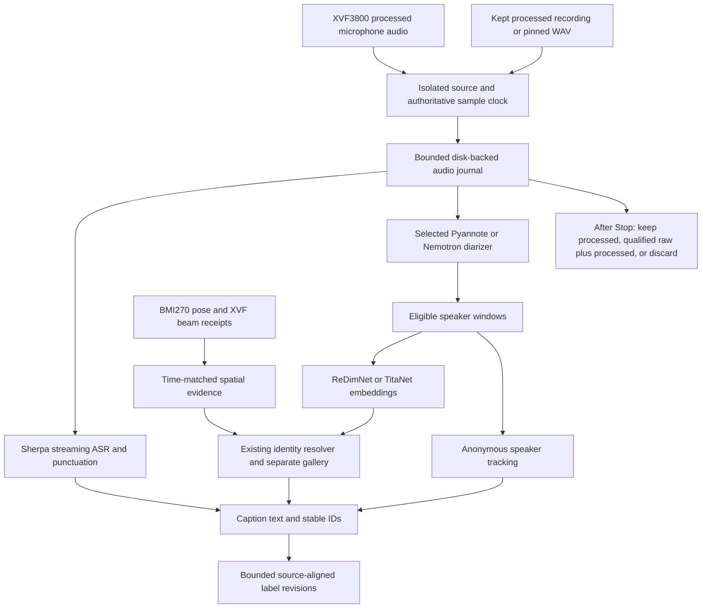

# Architecture and mathematics of the runtime candidate

Read [MODE_GUIDE.md](MODE_GUIDE.md) for selection and measured status, then the
matching `pipelines/` sheet for its exact geometry. This document explains the
shared mechanisms. It does not turn an implemented path into a native or
accuracy qualification.

## From a microphone to a caption

The graph is a conceptual data-flow map; exact activity, tracking and identity
consumers differ by the retained mode. Spatial evidence is used only where the
selected association policy consumes it. It is not inserted into the neural
speaker embedding or Nemotron's internal attention state. Anonymous processing
does not require a named gallery.

`installed_engine.py` verifies and binds the existing installed engine. It keeps
one model bundle per session and reuses model state across pushes. A new session
has a new owned worker process. `installed_source.py` owns the isolated physical
source, while `audio_journal.py` and `storage.py` provide disk-backed audio and
indexed persistent history. The GUI is a consumer; it does not execute neural
inference on its event loop.

## Clocks, blocks and recording

For model sample index `n` and rate `fs = 16000`, source time is `t = n/fs`.
Sample index is authoritative for interval alignment. A callback or publication
timestamp says when data became available; it is not an exact acoustic-arrival
time. Keep these clocks separate when calculating latency.

An interval `[n0,n1)` contains exactly `n1-n0` samples. A 300-second ordinary
session therefore admits 4,800,000 source samples. The limit is a policy value,
not a model cache or file-format assumption. Longer admitted developer sessions
use the same monotonic counters and segmented files.

PCM16 replay conversion is `x_float = x_int16 / 32768`. The retained live route
has its own documented O0 gain once; saved processed audio must not receive the
live gain a second time. The float spool preserves what the model received.
WAV is a documented replay/export representation, not a claim of bit identity
between integer and float formats.

The qualified physical packed route has 48 kHz stereo S32 transport. Each three
transport frames contains six slots: two processed outputs and MIC0–MIC3. The
four physical channels are **16 kHz signed PCM32**, with packing markers removed.
This is not four-channel 48 kHz raw audio. The runtime retains channel order,
sample counts, source epoch, priming/Stop disposition and timing metadata. A
shared clock does not prove identical acoustic/filter delay at the different
taps. [README_RAW_CAPTURE.md](README_RAW_CAPTURE.md) explains the exact mapping.

Audio storage is proportional to duration, but memory need not be. Processed
float32 mono requires `16000 × 4 = 64000 B/s`; its PCM16 WAV representation adds
`32000 B/s` when retained. Four physical PCM32 channels require `256000 B/s`.
Metadata, native events, replay exports and independent backups are additional
reservations. The admission calculation uses actual selected formats, not the
earlier hypothetical four-channel 48 kHz PCM16 estimate.

## Pyannote activity versus speaker identity

The installed Pyannote path consumes a ten-second, 160,000-sample segmentation
window. Its seven powerset classes represent no speaker, the three individual
local speakers, and their three two-speaker combinations. The installed mapping
is `000,100,010,001,110,101,011`. The selected segmentation policy derives speech
and overlap evidence; local output channels are not permanent human identities.

Speaker embeddings and the retained tracker connect voice evidence over time.
This distinction matters when testing: a good speech boundary is not proof of a
correct named identity, and overlapping speech can contaminate an embedding.
The new optional sparse schedule uses genuine cleaner windows; it does not
rewrite the Pyannote model or claim to reproduce DIART's trained pooling layer.

## Nemotron chunking and context

Nemotron configurations use 80 ms encoder frames. For chunk `C` and right context
`R`, nominal input buffering is `(C+R) × 0.08 s`. This excludes computation,
queueing, source delivery and stable-label decisions. Output probabilities use
a separate 10 ms clock; nonempty input in the retained native endpoint has
`floor(N/160)+1` output frames including EOF behavior.

The speaker cache retains representative past context, the FIFO retains recent
context, and the update period controls cache updates. More context can improve
continuity, but changes compute and memory demand. A shorter chunk runs inference
more often. Consequently, a smaller nominal input buffer can have **larger**
compute RTF and growing actual latency.

For the audited native geometry, total positional extent is
`cache + FIFO + left + chunk + right`; it must fit the pinned model's position
limit. Static validity only establishes that the parameters satisfy the runtime
rules. It does not establish speaker quality or real-time performance.

The compact 3.04-second candidate reduces cache/FIFO context, so its improved
RTF must be assessed against quality. The two-thread Chunk52 candidate instead
keeps geometry and model bytes unchanged; its first matched test produced
identical probabilities. That distinction is why numerical equivalence is
appropriate for the thread change but not for the context experiment.

The probability handoff has a separate duration-scaled scratch reservation.
For positive policy maximum `T` seconds, exact13
[nemotron_binding.py](nemotron_binding.py) allocates one reusable float32 array
of shape `(floor(16000*T/160)+1, 8)`:32 bytes per reserved output frame.
That is960,032 B at300s or11,520,032 B at3600s per D1 workspace. The C ABI still
copies all retained rows (`count-base`) into this array before new rows are
copied for emission; it is not a range-copy API. This reservation is neither
all-audio buffering nor a measured resident-memory/native-history bound. See
[the RAM guide](RAM_RESOURCE_GUIDE.md) for the24-hour arithmetic and limits.
## ReDimNet, TitaNet and the name resolver

Both retained embedding paths produce a 192-element representation. If raw
embedding vector `v` is finite and nonzero, the runtime normalizes it as
`e = v / sqrt(sum(v_i²))`. Similarity to another normalized vector `g` is the
dot product `sum(e_i g_i)`, equivalent to cosine similarity. A zero or nonfinite
vector fails explicitly.

ReDimNet and TitaNet have different preprocessing/model contracts. Their vector
dimensions matching does not make their coordinates interchangeable. Each has
its own model hashes, namespace and enrolled gallery. No cross-model cosine
comparison or silent gallery conversion is valid.

The retained identity resolver considers more than the top cosine score: it
also checks the top-versus-runner-up margin, current-query support and voice
consistency before updating a bounded prototype history. The implementation
preserves the existing configured thresholds. Absence of adequate evidence
means Unknown/Pending, not an invented name. Empty galleries cannot establish
named-speaker matching, even when the embedding model executes successfully.

## Provisional labels and revisions

ASR text and speaker evidence arrive at different times. A caption has a stable
ID, source interval and text revision ID. Later speaker evidence may revise its
speaker label inside a finite recent window. It must target the same interval
and current text revision, without duplicating captions or rewriting words.

For two diarizers, output slot0 in one model is not necessarily output slot0 in
the other. Their source-aligned activity/overlap must support an explicit
permutation/identity mapping; ambiguous mappings must abstain. The optional
second-worker path is experimental and needs a separate resource admission.
Its failure must leave primary text/labels available. Skipping arbitrary gaps
in a continuous diarizer while pretending its state is continuous is invalid.

The simpler single-D1 late-label path needs no second model: show ASR text with
Pending/Unknown, then apply genuinely supported recent identity evidence. These
are two distinct architectures, not two names for the same implementation.

## Motion and microphone-array geometry

The mounted sensor configuration is reused. Device axes are right/up/out of the
screen. The confirmed sensor-to-device rotation is
`[[0,1,0],[-1,0,0],[0,0,1]]`. The live XVF geometry places the four microphone
centers along a 9.99 cm line with the array center at zero. The supplied mounting
measurements place the IMU approximately `(-.045,-.160,-.015)` metres from that
center in device coordinates.

The worker integrates angular velocity into a quaternion and uses gravity and
quiet periods for tilt/bias correction. For vector `r` from sensor to array
center, rigid-body acceleration correction is
`f_center = f_sensor + alpha × r + omega × (omega × r)`.
It accounts for acceleration caused by rotating an off-center sensor; it does
not provide reliable absolute room translation by double integration.

The BMI270 has no absolute yaw or position reference. Relative heading can drift,
and a linear array retains front/back ambiguity. Detected movement or an invalid
pose suspends/clears location assumptions while preserving voice evidence.
Raw displayed beams stay device-relative. Association may transform a
time-matched bearing to the relative anchor frame where the retained policy
uses it. A developer graphic's visual zero changes only its drawing offset.
Current live pose must never be applied to an old WAV without recorded motion
sidecar support. See the delivered [mounted-motion guide](../../../completion_20261001/MOTION_GUIDE.md)
for retained calibration provenance; its v27 slot/shortcut descriptions are
historical, not the new storage/launcher behavior.

## Performance and validation

Component `RTF = compute wall seconds / delivered audio seconds`. Report model
loading, source pacing, first output, stable attribution, final drain and GUI
latency separately. Bounded queue growth and RAM/RSS stability over time matter
more than a single short-input average. More RAM can allow additional residency;
it does not remove a compute-per-audio-second deficit.

Read [RAM_RESOURCE_GUIDE.md](RAM_RESOURCE_GUIDE.md) for physical RAM versus
virtual-address and storage limits. Numerical agreement, functional completion,
native CM5 execution, sustained real-time qualification and labeled quality are
separate evidence categories throughout these documents.
